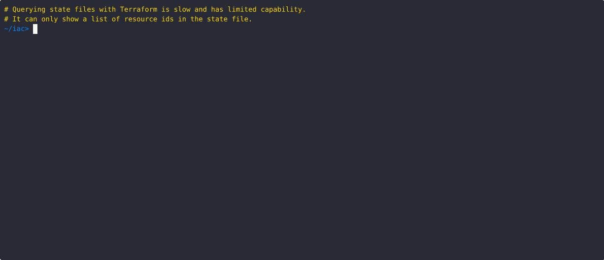

<div align="center">

# tfctl

**Supercharge your Terraform workflow with powerful CLI queries**

[](https://golang.org/)
[](https://goreportcard.com/report/github.com/tfctl/tfctl)
[](https://github.com/tfctl/tfctl/releases)
[](https://opensource.org/licenses/Apache-2.0)

</div>

**tfctl** is a command-line tool for querying Terraform and OpenTofu infrastructure. State querying of multiple backends is a main use-case, but tfctl can also query the broader Terraform ecosystem - modules, organizations, workspaces, etc - to power reporting and automation.

## Key Features

**Multiple Backend Support** - Works with HCP Terraform, Terraform Enterprise, local state files, S3 backends, and module registries.

**Fast Performance** - Built-in Go with concurrent operations and intelligent caching.

**Flexible Output** - Filter, sort, and transform results as JSON, YAML, or formatted tables.

**Secure** - Supports OpenTofu encrypted state files and multiple authentication methods.

**Comprehensive** - Query any attribute available through the Terraform APIs.

<a href="docs/asciinema/sq.gif" target="_blank" rel="noopener noreferrer">

</a>

## Why tfctl?

The native Terraform CLI provides essential IAC tooling for managing the lifecycle of resources it creates. But it lacks powerful state querying tools and offers no easily accessible way to query other elements of the Terraform ecosystem like workspaces, organizations, or module registries. This is especially problematic for automation use cases, when you need programmatic access to infrastructure metadata, state history, or cross-workspace insights.

**tfctl fills these gaps** by providing a unified, high-performance CLI for deep querying and analysis of the Terraform ecosystem, enabling better automation, reporting, and operational workflows.

## Installation

### Pre-built binaries

Download the latest release for your platform from the [releases page](https://github.com/tfctl/tfctl/releases).

Extract and move the binary to your PATH:

```bash
tar xvzf tfctl_*.tar.gz
sudo mv tfctl /usr/local/bin
```

### Go package install

```bash
go install github.com/tfctl/tfctl@latest
```

### Homebrew

```bash
brew tap tfctl/tfctl
brew install tfctl
```

**See the full [Installation Guide](docs/installation.md) for other options, plus installing man and TLDR pages.**

## Common Examples

```bash
# Find all workspaces containing "prod" across your organization
tfctl wq --filter 'name@prod'

# Compare state versions to see what changed
tfctl sq --diff

# Summarize changes from a Terraform plan, only showing those resources that
# would be created.
terraform plan | tfctl ps plan.out --filter 'action=created'

# List modules by popularity across registries
tfctl mq --sort -downloads

# Export workspace data for automation
tfctl wq --attrs created-at,updated-at --output json
```

## Available Commands

| Command | Purpose | Example |
|---------|---------|---------|
| **`mq`** | Module query | `tfctl mq --filter 'name@aws'` |
| **`oq`** | Organization query | `tfctl oq --attrs email` |
| **`pq`** | Project query | `tfctl pq --sort created-at` |
| **`ps`** | Plan summary | `terraform plan \| tfctl ps` |
| **`rq`** | Run query | `tfctl rq --attrs status` |
| **`sq`** | State query | `tfctl sq --attrs arn --sort arn` |
| **`svq`** | State version query | `tfctl svq --limit 10` |
| **`wq`** | Workspace query | `tfctl wq --filter 'status@applied'` |

## Documentation

- **[Quick Start Tutorial](docs/quickstart.md)** - Detailed walkthrough with examples
- **[Command Reference](docs/flags.md)** - Complete flag documentation
- **[Attribute Guide](docs/attrs.md)** - Advanced filtering techniques
- **[Filter Expressions](docs/filters.md)** - Query syntax reference
- **[Environment Variables](docs/environment.md)** - Configuration via environment variables

## Roadmap

**tfctl** is currently read-only and focused on querying. Version 1.x provides stable query functionality for local, TFE/HCP and S3 backends.

**Planned features:**
- Workspace and state manipulation.
- Enhanced S3 backend configuration options.
- Advanced reporting and dashboards.

*Want a feature? [Open an issue](https://github.com/tfctl/tfctl/issues) and help us prioritize!*

## Contributing

Contributions are welcome! Whether it's:
- Bug reports and fixes
- Feature requests and implementations
- Documentation improvements
- Ideas and feedback

**Get started:** Fork the repo, make your changes, and submit a PR. Check out our [issues](https://github.com/tfctl/tfctl/issues) for good first contributions.

## AI Acknowledgment

This project uses AI-assisted tools (mostly GitHub CoPilot w/Claude Opus and Gemini 3) selectively:

- **AI-assisted** — The `si` command (not yet documented), test scaffolding, and most of the documentation were created with AI assistance and reviewed before inclusion.
- **Routine refactoring** — AI tools assisted with lint corrections and minor optimizations.

 **All query command implementations (`oq`, `sq`, `wq`, etc.), and supporting code, were developed without AI assistance.**

## Verify releases

We sign release artifacts with GPG. To verify the integrity and authenticity of downloaded artifacts:

**Download and verify**
```bash
# Download the artifact and its signature
curl -L https://github.com/tfctl/tfctl/releases/latest/download/tfctl_linux_amd64.tar.gz -o tfctl_linux_amd64.tar.gz
curl -L https://github.com/tfctl/tfctl/releases/latest/download/tfctl_linux_amd64.tar.gz.sig -o tfctl_linux_amd64.tar.gz.sig

# Import the public key (one-time setup)
curl -L https://raw.githubusercontent.com/tfctl/tfctl/master/KEYS | gpg --import

# Verify the signature
gpg --verify tfctl_linux_amd64.tar.gz.sig tfctl_linux_amd64.tar.gz
```

**Expected output**
```
gpg: Signature made [date] using RSA key [key-id]
gpg: Good signature from "tfctl Release Key"
```

If the signature verification fails or shows warnings, do not use the artifact and report the issue.

---

## License

This project is licensed under the Apache License 2.0. See the [LICENSE](LICENSE) file for details.

*Questions? [Open an issue](https://github.com/tfctl/tfctl/issues)*

## Trademarks

- Terraform, Terraform Enterprise, and HCP Terraform are trademarks or registered trademarks of HashiCorp, Inc.
- OpenTofu is a trademark of The Linux Foundation.

Use of third-party names in this project is for identification and descriptive purposes only and does not imply endorsement, sponsorship, or affiliation.
